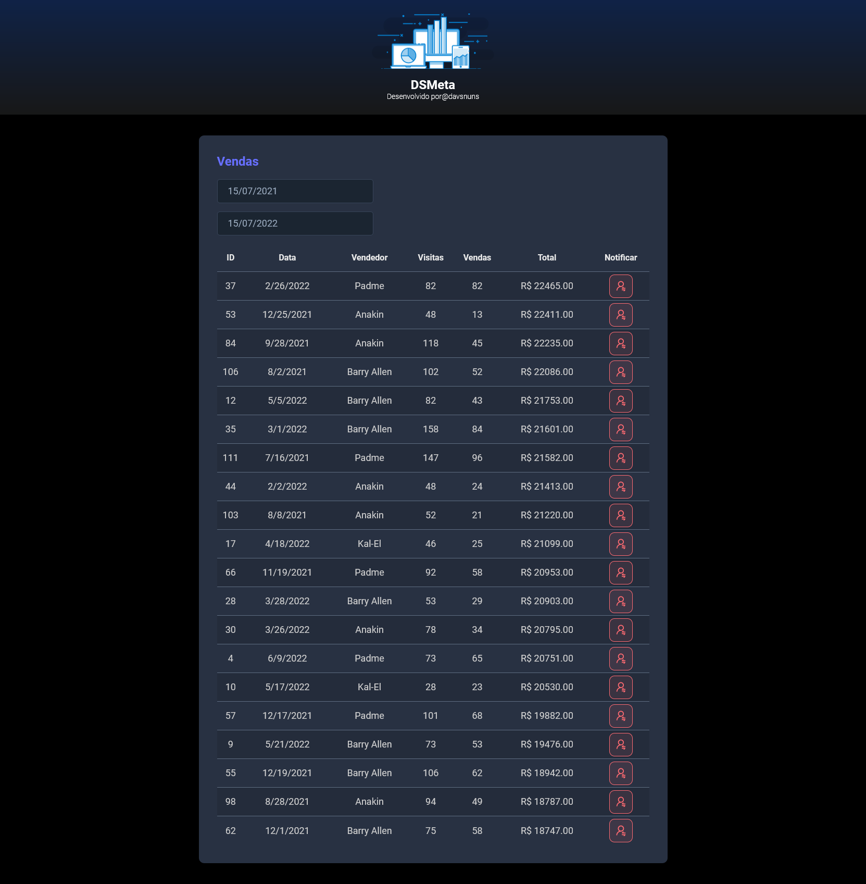

# DsMeta

This is a full stack project developed @ "Semana Spring React" promoted by Devsuperior.

## Tech Stack

## Link
https://david-dsmeta.netlify.app

## Preview

## Author

- [David Nunes](https://www.github.com/Dnuns)
